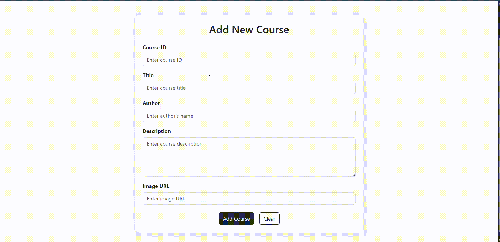

# 📚 Course Management App

A Full Stack Web Application for managing online courses — built using *React, **Spring Boot, and **MySQL*.

## 📸 Gif

| Home Page             | Add Course                 | Explore Courses             |
| --------------------- | -------------------------- | --------------------------- |
|  |  |  |

## 🚀 Features

- 🏠 *Home Page* – Welcome screen with intro and navigation
- ➕ *Add Course* – Add a new course with details like title, description, etc.
- 🔍 *Explore Courses* – View all available courses
- 📞 *Contact Me* – Form to contact developer/admin
- ℹ *About Page* – Info about the project or team

## 🛠 Tech Stack

### Frontend – React

- React JS (with functional components)
- Axios for API calls
- React Router DOM
- Bootstrap

### Backend – Spring Boot

- Spring Web
- Spring Data JPA
- CORS Configuration
- REST API Design

### Database – MySQL

- Course Entity
- JPA Repository
- Database connectivity via application.properties
- Hibernate

---

## ⚙ How to Run

### 1. Clone the repository

bash
git clone https://github.com/Kavya75340/Course_App.git
cd Course_App

---

### 2. Backend Setup (Spring Boot)

- Open the backend/ folder in your IDE (like IntelliJ or Eclipse)
- Configure application.properties with your MySQL DB details:

properties
spring.datasource.url=jdbc:mysql://localhost:3306/newdb
spring.datasource.username=root
spring.datasource.password=your_password
spring.jpa.hibernate.ddl-auto=update

- Run the main class:

bash
./mvnw spring-boot:run

---

### 3. Frontend Setup (React)

bash
cd frontend
npm install
npm run dev

> React app will run on http://localhost:5173

---

## 📂 Folder Structure

course-app/
├── backend/        # Spring Boot backend
│   └── src/
├── frontend/
|     └── src/
|         └── Component/   #React Component
├── README.md
└── Gif/

---

## 📬 Contact

*Created By:* Kavya Varshney
📧 Email: \[[Anurag Goyal-goyalanurag2005@gmail.com]]
🔗 LinkedIn: [linkedin.com/in/Anurag Goyal](www.linkedin.com/in/anurag-goyal-05929b317)
